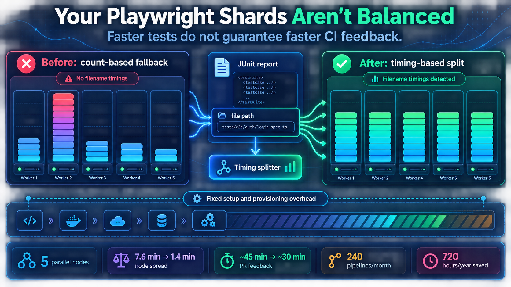

# How We Took E2E CI From 45 Minutes to 30 — With Three Fixes That Had Nothing to Do With Playwright

*A silently misconfigured test split, specs executing twice, and fixed overhead nobody had measured. If you run sharded end-to-end tests in CI, at least one of these is probably costing you right now.*

---

We spent three months migrating an eight-year-old end-to-end suite — 354 tests across 38 files — from TestCafe to Playwright. That part is [a different story](./testcafe-playwright-ai-migration.md).

This one is about the CI work underneath it, which turned out to be where most of the wall-clock win actually came from:

| | |
|---|---|
| **PR feedback times** | **45 min → 30 min (-33%)** |
| **Node balance (spread across 5 machines)** | **7.6 min → 1.4 min (-82%)** |
| **Total test work per run** | **82.5 min → 67.2 min (-18.5%)** |
| **Superseded specs still executing** | **73 → 0** |
| **Idle parallelism** | **effectively eliminated** |
| **Developer time recovered** | **720 hours/year** |

Three findings got us there. None of them were visible in the CI dashboard, and none of them would have been fixed by choosing a different test runner.

---



---

## The thing that started the investigation

Partway through the migration I measured what we'd bought. Per test, in wall-clock terms, Playwright was **2.3x faster** than TestCafe — **6.5 seconds versus 15.1**. Unambiguous, and it confirmed the framework choice.

But wall-clock time wasn't following. More of the suite moved onto the faster framework every week, and the number developers actually waited on barely moved. A 2.3x per-test improvement was producing nothing like a 2.3x improvement in the thing anyone cared about.

That gap is the whole story. Something was sitting on top of the framework, absorbing the gains.

---

## Finding 1: Be precise about which quantity you're reducing

This sounds like pedantry. It was the prerequisite for everything else, because until I separated these I was measuring three things at once and drawing conclusions from the average.

- **Billed machine time** — the sum of all node durations. What your provider charges for.
- **Developer wait** — the duration of the *slowest* node. What actually gates a merge.
- **Idle time** — the sum over nodes of `(slowest node - that node)`. Wasted parallelism.

They move independently, and sometimes in opposite directions. **Rebalancing work across nodes reduces developer wait while slightly *increasing* billed time**, because a node that finishes early stops billing. Only *removing* work improves both.

This is why “we reduced CI time by X%” is a claim worth interrogating. Ours reduced all three, but for different reasons, and saying so precisely is what made the numbers hold up when people checked them.

**One measurement trap worth passing on:** do not sum the step durations of a parallel job. One of our setup steps runs in the background, concurrently with the tests, so summing steps counted it repeatedly — 295 machine-minutes against a true 154, wrong by nearly 2x. Measure each node's wall time from first step start to last step end.

**And don't conclude from a single run.** Our environment-provisioning step alone varies by 2.7 minutes run to run, which is larger than many of the improvements worth chasing. Every number in this post is drawn from repeated runs for that reason.

---

## Finding 2: The test split was silently count-balanced, not time-balanced

This is the one I'd most want another team to know. It's specific to Playwright, it's completely silent, and it was absorbing the entire benefit of running five machines.

Our CI distributes tests with `circleci tests split --split-by=timings`. That command matches the file paths it's given against the `file` attribute of previously uploaded JUnit reports.

**Playwright's built-in JUnit reporter does not emit `file`.** It emits `name` and `classname` only. The source comment in the reporter reads `Skip root, project, file`, and there's no configuration option to change it.

*(True as of `@playwright/test` 1.59.1 — check before assuming it still is. This is exactly the kind of thing that gets fixed upstream, and I'd be glad if it has been.)*

Without `file`, timing-based splitting has nothing to match on, and CircleCI falls back to weighting by **name**. It isn't an error. It's one line in the step log:

```text
Error autodetecting timing type, falling back to weighting by name.
Autodetect no matching filename or classname.
```

Name-weighting balances test **counts**, not **durations** — which for an e2e suite, where individual tests range from two seconds to two minutes, is barely better than random. A representative run handed the five nodes near-identical counts, **64/99/78/50/66 tests**, carrying between **2.4 and 10.0 minutes** of real work. The legacy framework, whose reporter **did** emit `file` and therefore had valid timing history, stayed inside a tight **8.5–10.8 minute** band on the very same run. The contrast is what gave the diagnosis away.

### The fix

A small custom reporter that annotates the JUnit output with each spec's absolute path. Three implementation details that matter more than the idea:

- **It runs in `onExit`,** documented as firing after every reporter has received `onEnd` — so the JUnit file is already flushed when you rewrite it.
- **The rewrite is idempotent,** so reruns and retries are safe.
- **Failures are swallowed with a warning.** A reporting concern must never be able to fail a test run. If annotation breaks you get worse splitting, not a red build.

Deliberately scoped to reporting and filtering only, so that no test execution behaviour changed and no new flakiness could be introduced.

**Result:** node spread collapsed from **7.6 minutes to 1.4 minutes** — all five machines finishing together, none waiting on a straggler, idle parallelism effectively gone. `Autodetected filename timings` now appears on all five nodes and the fallback warning appears nowhere.

### Two habits worth keeping

**Assert on your split diagnostics.** We now check for the success line on every node and the absence of the fallback warning. A silent degradation you don't check for is one you'll have for months.

**Expect one bad run after any rename.** The timing manifest is built from *previous* runs, so anything that renames or moves spec files invalidates their history. The next run splits badly and self-heals on the one after. Don't panic-debug it — re-run.

---

## Finding 3: Track progress from what executes, not from what exists

We tracked the migration two ways, and the distinction turned out to be the most transferable thing on the whole project.

A dashboard gave day-to-day visibility — useful for standups, for showing the shape of remaining work, for spotting untouched areas. It ended at 100% and was genuinely good at that job.

But the number we *reported* came from parsing JUnit results: what actually executed, per framework, per run. Those answer two different questions:

- **Do new tests exist for this area?** — the natural thing to count, and the natural thing to get wrong. It counts specs marked `fixme` or `skip`, which exist but never run.
- **Has the legacy suite actually been switched off?** — the thing you care about, and the only one that shows up in CI time.

That second measurement is what surfaced **73 superseded specs still executing** alongside their replacements. Retiring them is most of the **-18.5% reduction in total test work**, and unlike a rebalance it's a durable saving: it lowers cost on every run, on every branch, across every repository that shares the suite.

A related trap in the same family: **grepping for a skip directive is not a safe proxy for “this file is disabled,”** because a skip applies to its own fixture rather than the whole file. A file with one active fixture beside a skipped one looks disabled and isn't.

Build the executed-results measurement early. It's the difference between a progress bar and a fact — and in our case it paid for itself immediately.

---

## Where the last of the win came from

The split fix bought balance. Retiring duplicated specs bought throughput. But the final step down to **30 minutes** came from finishing the migration, via a property of the two frameworks that took me embarrassingly long to appreciate.

**The legacy framework splits by file.** So per-node time cannot fall below the largest indivisible file, no matter how many machines you add. Ours was 11.4 minutes. Three files alone accounted for **77% of all remaining legacy test time**.

Retiring those three broke the floor, because Playwright parallelises across workers **within** a spec as well as across nodes. That's the structural reason “just add more machines” had stopped helping — and the reason finishing the migration was worth more than any remaining infrastructure tuning.

---

## What 15 minutes a run is actually worth

We measured pipeline volume directly rather than guessing: **240 pipelines in a single month**, ranging from 3 to 71 a day.

```text
15 min saved × 240 pipelines = 3,600 min/month
                           =    60 hours/month
                           =   720 hours/year
```

**720 hours a year** of aggregate waiting-for-CI, removed from a single repository — and the suite runs on two sibling repositories' pipelines too, so the programme-level figure is a multiple of that.

Worth noting how badly this had been underestimated: our original business case assumed 10 runs a day. Measured reality was roughly **5x that on a weekday**. Every projection built on assumed volume was understating the return substantially. **Measure your pipeline count before you model anything.**

---

## Why we committed to 30 and not 15

The original business case implied a 15-minute suite. We committed to sub-30 instead, hit it, and I'd make the same call again.

Every node pays roughly **14.2 minutes of fixed overhead** before a single test result exists:

```text
Attaching workspace                    0.4m
Install dependencies for environment  1.8m
Wait for services to be ready         6.2m – 8.9m
Test-environment deployment           ~2.0m
Browser install                        ~0.6m
Compile and misc                       ~1.5m
```

At 14.2 minutes of unavoidable per-node cost, a 15-minute total was never reachable by *any* framework choice — the arithmetic rules it out before you write a line of code. The realistic floor for this architecture is around **26 minutes**. Going below that means changing how the environment is provisioned, or moving to test selection on PRs with the full suite on merge, which is a coverage-policy decision rather than a technical one.

Finding that number early is what let us promise something we could deliver. **Committing to a target bounded by your actual architecture and hitting it beats committing to an aspirational one and explaining the miss** — and that conversation is much easier to have before the work than after.

There's still headroom, incidentally. The environment deployment installs the same fixtures independently on all five nodes — pure duplication, paid five times over. That's the next one.

---

## What I'd tell someone debugging their own pipeline

**Read your CI's own warnings.** The largest problem here printed a diagnostic on every node of every run for months. Nobody read it, because it wasn't an error and the build was green.

**Use a control group.** An early theory that one specific node suffered a platform-level penalty was disproved by running the same suite in a second repository that lacked the suspected cause. Once splitting worked, a different node became the slowest — so the pattern had been a symptom of the broken split concentrating heavy work, not a property of the node. Distributed-systems debugging habits apply to CI pipelines far more than people expect.

**Say which quantity you reduced.** Billed time, developer wait, and idle time are three different numbers that move independently.

**Never conclude from one run** if your infrastructure variance is the same order as your improvement.

**Separate the framework's merits from your pipeline's behaviour.** Playwright was 2.3x faster per test from the first day it ran — that was true the entire time wall-clock times were flat. Both facts were real simultaneously. Knowing which of your gains came from the framework and which from your own misconfiguration is what makes the result reproducible for anyone reading.

---

*The companion post covers the migration itself — [how an agent loop wrote the first draft of 55,000 lines of Playwright tests, and why the harness mattered more than the AI](./testcafe-playwright-ai-migration.md).*
