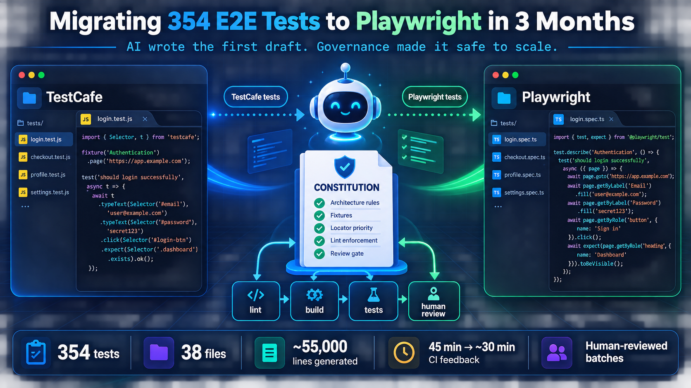

# Migrating 350+ E2E Tests to Playwright in 3 Months — With AI Writing the First Draft

*What four AI approaches actually delivered, why the harness mattered more than the agent, and what the agent still got wrong.*

---

## The outcome

Our end-to-end suite had been running on TestCafe for about eight years. By the time I picked up the migration it was 354 tests across 38 files, taking around 45 minutes of CI wall time across five parallel machines, with a flakiness rate high enough that a meaningful share of pull requests needed a rerun before anyone trusted the result.

The case for Playwright was not controversial. Native browser protocols instead of a proxy, auto-waiting assertions, trace viewer, and an actively maintained project behind it. What was interesting — and what I want to write about — is that this migration happened at a moment when it was suddenly reasonable to ask whether an AI agent could do most of the conversion.

The short answer: yes, mostly. Roughly 55,000 lines of test code landed, and the first-pass conversion for most of it was machine-generated.

On timeline, because “we migrated 350 tests with AI” invites a fair amount of scepticism about what that means: the conversion work took three months. That sat on top of a preceding phase of proof-of-concept work, framework feasibility evaluation, design review, and building the harness — which is where the leverage actually came from, and which no amount of agent throughput would have let me skip. Three months is the execution window, not the whole story, and the ordering matters more than the duration.

The longer and more useful answer is that the AI was never the bottleneck, and treating it as the interesting part is how these projects fail. What determined success was the architecture the generated code had to conform to — and the discipline of reviewing everything the machine produced before it became thirty files of the same mistake.

Here's the whole thing, including the parts that didn't work.

---

## TL;DR: the migration system



**The short version:** AI supplied the first draft; the constitution, mechanical checks, and human review gate made that draft safe to scale.

---

## Which AI approaches are actually suited to this

There are four obvious ways to point AI at a test migration. Only one of them fits, and the reasons are structural rather than a matter of model quality.

### Codegen: the wrong shape of output

Playwright ships `codegen`, which opens a browser, watches you click, and writes test code. It's genuinely good at what it does — it prioritises role, text, and test-id locators, and when several elements match it tightens the locator to disambiguate.

But look at what it produces and what a migration needs, and they barely overlap.

Codegen records a linear session. It doesn't infer assertions — the documentation has you click a toolbar icon and pick each element and assertion type by hand. It has no concept of your page-object layer, so it emits inline locators where your architecture wants component/page objects. It has no idea which of your existing page objects already models the screen it just recorded. And it starts from a running browser and a human driving it, which means the cost scales linearly with the number of tests — exactly the thing you're trying to avoid across hundreds of tests.

Codegen is a good tool for exploring an unfamiliar page and for bootstrapping a brand-new spec. It is not a migration tool, because a migration is fundamentally a **code translation** problem with a target architecture, not a recording problem.

### Playwright MCP: designed for a different job

The Playwright MCP server exposes browser automation to an LLM through accessibility-tree snapshots. It's a genuinely well-built piece of software and it was tempting, because “give the agent a real browser” feels like the obvious unlock.

It's the wrong tool here, and notably Microsoft says so themselves. The project documentation draws an explicit line between MCP and their CLI-plus-skills path: MCP is for specialized agentic loops that benefit from persistent state, rich introspection, and iterative reasoning over page structure — exploratory automation, self-healing tests, and long-running autonomous workflows. For coding agents it recommends the CLI instead, because CLI invocations avoid loading large tool schemas and verbose accessibility trees into the model context.

That is a precise description of a test migration. You are reasoning over a large existing codebase, holding a set of conventions in context, and emitting a lot of code. Every token spent on an accessibility snapshot is a token not spent on the source file you're translating and the architecture you're translating it into.

Where MCP earns its place is **after migration**: debugging a specific failure interactively, or exploring a page you're writing new coverage for. Different job, different tool.

### Interactive chat: correct output, no memory

Pasting a TestCafe file into a chat assistant and asking for the Playwright equivalent works well. I did it many times, and for one-off conversions it's still what I'd reach for.

It does not scale to 38 files, for one reason: conventions decay across sessions.

Every new conversation starts without knowing that imports come from `../fixtures` and never from `@playwright/test`, that CSS selectors are lint errors requiring written justification, or that page objects extend a `BasePage` with a specific contract.

You can re-explain all of it every time — and you will, and around file twelve you'll paste a slightly shortened version, and drift begins. Reviewing 55,000 lines where the conventions wobble by author-session is materially worse than reviewing 55,000 consistent lines.

### What's left: a batch loop with injected rules

The approach that actually worked is unglamorous. A bash runner drives a coding agent in a loop. Each iteration:

1. Reads a backlog file to find the next pending task.
2. Loads a **constitution** — the authoritative conventions document — as mandatory pre-context.
3. Builds a structured prompt: task description, plus constitution, plus repo-layout rules, plus a file-reading protocol.
4. Drives the agent to produce and apply changes.
5. Appends the outcome to an append-only progress log.
6. Writes its own reasoning to a separate thoughts log.

Then it stops and waits for me to look at what it did before starting the next one. `./run.sh 20` queues up twenty tasks; I review each batch and commit manually.

That review gate is deliberate, and it's the part I'd defend hardest. It is tempting to build the fully unattended version — the loop supports it, you just remove one line. But the failure mode of agent-generated code isn't that it doesn't compile; it's that it compiles, passes, and quietly encodes a bad pattern that you then find replicated across thirty files.

A human checkpoint every iteration costs a few minutes and catches that while it's one file instead of thirty.

This pattern circulates under the name RALPH — the essential idea being that a dumb outer loop plus a rich, re-injected context document beats a clever single prompt, because the loop's statelessness is what keeps output consistent. Every iteration gets exactly the same rules, which is the property you want when the whole risk of the project is drift.

---

## The constitution is the actual product

If you take one thing from this post: **the AI was not the hard part. The hard part was building something for it to conform to.**

Before any bulk generation, I shipped a harness — infrastructure only, no test conversions, nothing removed from the old suite:

```text
test/e2e/
  specs/       → test files
  fixtures/    → auth, org setup, feature flags, console-error collection
  pages/       → page object models
  utils/       → API-layer helpers: users, orgs, flows, SSO, RBAC
```

Some deliberate decisions in there:

**Fixtures instead of `beforeEach`.** A fresh user and org per test, auth cookies injected via `storageState`, feature flags declared per describe-block with `test.use({ features: [...] })`. Composable and type-safe, and it means test isolation is structural rather than something each test remembers to do.

**Page objects per component, not per page.** The big screens got decomposed into component classes rather than one 600-line god object. Composable, and independently useful to the agent — a smaller unit is a smaller thing to get wrong.

**A strict locator priority order, enforced rather than suggested:**

```text
getByRole        → interactive elements (preferred)
getByLabel       → labelled form fields
getByPlaceholder → unlabelled inputs
getByText        → static content
getByAltText     → images
getByTitle       → last semantic option
[data-testid]    → escape hatch, only if no semantic alternative
.css-class       → Lint error, requires written justification
```

That last line is the one that matters for AI-generated code. Left alone, a model will happily reach for a CSS class, because in its training data plenty of people do. Making it a Lint failure converts a code-review argument into a build failure — and a build failure is something the agent can see and fix without me.

The constitution is a single document encoding all of it: repo layout, import rules, the page-object contract, locator priority, which lint rules are errors versus warnings, how to write a justified `eslint-disable` with a mandatory TODO, the logging interface, file naming, and the spec template.

Injecting it on **every** iteration is what made conventions hold across tens of thousands of lines without re-instruction between sessions. This is the whole trick. There isn't a cleverer one.

One more structural choice that paid off: **two repositories.** A tracking repo held the backlog, the constitution, the runner script, and the progress logs. The code repo held only test code. The agent's ephemeral state — half-finished reasoning, retry logs, scratch notes — never touched the reviewable codebase. When you're reviewing machine-generated code in batches, keeping the diff clean of the machine's own exhaust is worth more than it sounds.

---

## What conformance actually looks like

Abstract talk about conventions is cheap, so here is one real test, before and after.

### TestCafe first

```javascript
fixture("Header");

test("Has logo and appropriate dropdowns when using SSO", async (t) => {
  await attachClients(t);
  await attachUser(t, {
    user: { user_preferences: { userExpertise: "intermediate" } }
  });
  await attachSsoSession(t);

  await t.navigateTo(generateUrl(t, `/org/${t.ctx.org.id}`, "/"));

  const appHeader = new AppHeader();

  await t
    .expect(appHeader.exists).ok()
    .expect(appHeader.helpButton.exists).ok()
    .click(appHeader.helpButton)
    .expect(appHeader.helpMenu.exists).ok()
    .expect(appHeader.helpMenu.options.help.exists).ok()
    .expect(appHeader.helpMenu.options.support.exists).ok()
    .expect(appHeader.helpMenu.options.idea.exists).ok()
    .pressKey("esc");

  await t.expect(appHeader.orgChooser.exists).notOk();

  // ... test-case tracking metadata
});
```

And the Playwright version the loop produced:

```typescript
import { expect, test } from "../fixtures";

test.describe("Header", () => {
  test("has logo and appropriate dropdowns when using SSO", async ({ app, page }) => {
    // TEST SCENARIO: SSO user sees help menu options, no org chooser, and user menu
    expect(app).not.toBeNull();
    await initializeDummySso(app.token, app.org.id, app.user.id);

    await page.goto(generateUrl(app.hostname, `/org/${app.org.id}`, "/"));
    await new OnboardingDialog(page).dismiss();

    const appHeader = new AppHeader(page);

    // Assertion 1: Header is visible
    await expect(appHeader.root).toBeVisible();

    // Assertion 2: Help button opens help menu with expected options
    await appHeader.helpButton.click();
    await expect(appHeader.helpMenu.root).toBeVisible();
    await expect(appHeader.helpMenu.help).toBeVisible();
    await expect(appHeader.helpMenu.support).toBeVisible();
    await expect(appHeader.helpMenu.idea).toBeVisible();

    await page.keyboard.press("Escape");

    // Assertion 3: Org chooser is NOT visible for SSO users
    await expect(appHeader.orgChooser).toBeHidden();

    logger.trace(
      { headerVisible: await appHeader.root.isVisible() },
      "Header state"
    );
  });
});
```

Every difference there is a constitution rule rather than a stylistic preference:

- `import { expect, test } from "../fixtures"` — never from `@playwright/test`, so the per-test user/org fixture can't be bypassed.
- Three setup calls collapse into the `app` fixture — `attachClients` / `attachUser` / `attachSsoSession` become one injected dependency.
- `.exists().ok()` becomes `.toBeVisible()` — web-first assertions that auto-wait, which is where much of the flakiness reduction actually comes from.
- `.notOk()` becomes `.toBeHidden()` — an explicit negative assertion rather than the absence of a positive one.
- Numbered assertion comments and a `TEST SCENARIO` header — mandated, and the single biggest reason batch-reviewing generated tests is tractable at all.
- `logger.trace()` at the end — the input to the assertion-tightening pass described in the appendix.

None of that is clever. All of it is written down, which is the point.

---

## The rules outlived the agent

The unexpected second-order effect: the constitution stopped being an agent artifact and became how the team wrote tests generally.

Once the locator ladder and the import rule were lint-enforced, they applied to everyone equally — a human writing a spec by hand hit the same build failure the agent did. A lint rule was also what blocked new tests from being added to the legacy framework at all, which is what actually stopped the old suite growing while we were trying to retire it.

That turned out to matter more than the throughput. A migration where only the tooling author knows the conventions stalls the moment they move on. Encoding them in a file the build enforces means the next person inherits the rules whether or not they ever read the document.

---

## What the agent got wrong

“AI did most of the work” is only useful if you also know **what kind of wrong to expect**, so here is the unflattering half.

**It was never wrong in the way people expect.** The generated code compiled, the conventions held, and the locators were usually reasonable. What it produced was code that *looked* right, which is a more expensive failure mode than code that obviously isn't.

The recurring categories, roughly in order of how much time they cost:

### Assertions that pass without proving anything

The dominant failure. A first-pass conversion reaches for `toBeVisible()` on a container that is always visible, or `toBeGreaterThan(0)` on a count it could assert exactly. The test goes green and tells you nothing.

This is why the trace-log audit pass in the appendix exists at all — it was built specifically to mop this up mechanically, because catching it by eye across hundreds of tests is not realistic.

### Silent scope loss

A legacy test asserting six things becomes a clean, idiomatic Playwright test asserting four. Nothing fails. Nothing flags it.

The only defence I found was comparing assertion intent test-by-test against the original rather than trusting a passing suite — and it's the reason I verified migration coverage title-by-title rather than by counting tests.

### Duplicated page-object methods

The agent couldn't find an existing helper, so it wrote a near-identical one. This is what the `// EOF` one-step file-read rule was introduced to fix, and it worked, but not before leaving some duplication behind.

### Over-reach on lint escapes

Given an `eslint-disable` mechanism, the agent would occasionally use it where a better locator existed. Requiring a `-- TODO:` justification on every disable made these easy to grep and audit later, which is the only reason they didn't accumulate.

What's worth noticing is that every one of those categories is *cheap to catch and cheap to fix* — but only because the harness existed. Assertion weakness gets swept up mechanically by the trace-log audit. Duplicated helpers became findable the moment the file-read rule landed. Lint escapes are one `grep` away because each one carries a mandatory justification.

None of these needed a smarter model; they needed somewhere for the failure to show up.

That's the real division of labour. The agent did most of the *typing* and a good share of the *translation*. It did close to none of the *judgment* — and judgment is where the remaining work lives.

Deciding whether a converted test still tests the thing the original tested isn't work I could delegate, and it's where most of my own time went.

Which is the encouraging part, if you're weighing whether to try this: the mechanical bulk of a migration really is delegable now. What you keep is the interesting half.

---

## The outcome

The migration landed. The legacy framework is gone from CI, not merely superseded on paper — a distinction worth making, because the two are easy to confuse and only one of them shows up in your build times.

| Metric | Result |
|---|---:|
| Legacy suite at start | 354 tests / 38 files |
| Legacy tests retired | 354 (100%) |
| Legacy framework | decommissioned |
| Playwright tests | 431 across 47 spec files |
| Migration tickets closed | 87 of 87 |
| Conversion window | 3 months |

On speed, the headline is straightforward and the detail is not. Per test, Playwright measured **2.3x faster** than the framework it replaced — 6.5 seconds against 15.1. End to end, PR feedback went from roughly **45 minutes to 30**.

But those two numbers don't reconcile the way you'd expect, and the gap between them turned out to be the most interesting engineering problem on the whole project. A 2.3x per-test improvement did **not** produce anything like a 2.3x wall-clock improvement, because three things were sitting on top of the framework: a silently misconfigured test split, a set of specs executing twice, and roughly 14 minutes per node of fixed infrastructure overhead that no framework choice touches.

That investigation is its own story and isn't about AI at all, so I've written it up separately: **Your Playwright Shards Aren't Balanced, and CI Has Been Telling You All Along**.

The part that belongs here is the lesson about attribution. **The framework was 2.3x faster from the first day it ran.** That was true the entire time wall-clock times were flat, and it would have been dishonest to claim the migration delivered a proportional speedup when most of the wall-clock win actually came from fixing a CI misconfiguration the migration happened to expose.

Both facts are real. A write-up that reports only the flattering one leaves its reader unable to predict what they'd get.

---

## What I'd tell someone starting this

**Build the harness before you generate anything.** The value of AI-generated test code is entirely determined by how good the thing is that it's conforming to. Without a page-object layer, a fixture model, and a locator policy, you get thousands of lines of plausible, divergent, unreviewable code. The agent is a force multiplier on your architecture, including when your architecture is bad.

**Put the rules in a file and inject them every single iteration.** Not in your head, not in a prompt you retype. Convention drift across sessions is the dominant failure mode of AI-assisted bulk work, and re-injection is the entire fix.

**Make your conventions machine-checkable.** A lint rule the agent can see and respond to is worth more than a style guide it has to be told about. Every convention you can convert from prose into a build failure is one you stop policing in review — and it applies to your human colleagues identically, which is what stops the conventions leaving when you do.

**Delegate the typing, not the judgment.** The agent's failure mode is code that looks right: assertions that pass without proving anything, and converted tests that quietly assert less than the originals. Nothing in your pipeline will flag either. Budget your own time for verifying intent test-by-test against the source, because that's the part that doesn't scale and the part that determines whether the migration was real.

**Pick the tool for the job, not the most impressive one.** Codegen is for exploration, MCP is for interactive debugging and self-healing loops. Bulk code translation wants a batch loop and a large, stable context. Microsoft documents this distinction themselves; it took me a feasibility pass to believe it.

**Verify coverage title-by-title, not by counting.** The most dangerous output is a converted file that passes and quietly tests less than the original. Test counts matching tells you nothing about that; comparing intent scenario-by-scenario against the source is the only check that catches it.

**Don't credit the migration for wins it didn't produce.** A faster framework and a faster pipeline are separate claims, ours diverged sharply, and being precise about which was which is what made the numbers hold up when someone checked them.

> *If there's a version of this to remember: the agent was the cheap part. What made it usable was a written contract it couldn't drift from, a build that failed when it did, and someone reading every batch before it became thirty files of the same mistake.*

---

# Appendix: Build the loop yourself

Everything below is the actual shape of what I ran, genericised. It's about 150 lines of bash and one long markdown file. There is no framework to install.

## The runner

```bash
#!/usr/bin/env bash
set -euo pipefail

TRACKING_REPO="/path/to/tracking-repo"  # backlog, constitution, logs
CODE_REPO="/path/to/code-repo"          # where test code actually lands
FEATURE_SRC_DIR="test/e2e"

BACKLOG="$TRACKING_REPO/kanban/backlog.json"
PROGRESS="$TRACKING_REPO/kanban/progress.txt"
THOUGHTS="$TRACKING_REPO/agent_thoughts.txt"
MODEL="<your-coding-model>"

iterations="${1:-1}"
shift || true

: > "$THOUGHTS"  # wipe thought log for a clean run

for ((i=1; i<=iterations; i++)); do
  echo "Iteration $i/$iterations"

  read -r -d '' prompt <<PROMPT_EOF || true
\$BACKLOG \$PROGRESS

CONSTITUTION (MANDATORY — READ FIRST):

Read \$TRACKING_REPO/.specify/memory/constitution.md before starting ANY task.
Every file you create or modify MUST conform. If the constitution conflicts
with patterns in existing code, THE CONSTITUTION WINS.

TWO-REPO LAYOUT:

1. TRACKING REPO (\$TRACKING_REPO): backlog, progress, constitution ONLY.
   NEVER write test code here.

2. CODE REPO (\$CODE_REPO): all test code under \$FEATURE_SRC_DIR/.

FILE READING PROTOCOL:
Every source file ends with a "// EOF" marker. Read the ENTIRE file up to
that marker in ONE step. Never read line-by-line or in chunks.

THOUGHT LOGGING:
Continuously append phase transitions, decisions, discoveries and blockers
to \$THOUGHTS as timestamped entries.

HUMAN INTERVENTION DETECTION:
Before each major operation, re-read \$THOUGHTS and grep for [HUMAN INTERVENTION]
or [CORRECTION]. If found: acknowledge it in the log, adjust your approach,
and continue with the corrected understanding.

TASK SELECTION:
Pick the task YOU judge highest priority — not necessarily first in the list.
SKIP any task marked "abandoned": true.
Work on ONE task only.

COMPLETION:
Update \$BACKLOG and append to \$PROGRESS, including a "Commit:" line with a
recommended conventional-commit message.
DO NOT git commit. The human reviews and commits.
Do NOT ask follow-up questions — you cannot receive answers. Make reasonable
decisions and document your reasoning.
If the backlog is fully complete, output <promise>COMPLETE</promise>
PROMPT_EOF

  result=$(your-agent-cli \
    --add-dir "$TRACKING_REPO" \
    --add-dir "$CODE_REPO" \
    --allow-all-tools \
    --model "$MODEL" \
    --prompt "$prompt")

  echo "$result"
  grep -E "^Commit:" "$PROGRESS" | tail -1

  [[ "$result" == *"<promise>COMPLETE</promise>"* ]] && {
    echo "Done."
    exit 0
  }

  [[ "$i" -lt "$iterations" ]] && \
    read -r -p "Review changes. Enter to continue (Ctrl-C to stop): "
done
```

## The five mechanisms that made it work

### 1. The constitution wins over existing code

This clause matters more than it looks. Any codebase mid-migration contains both the old patterns and the new ones. Without an explicit precedence rule, the agent will find a legacy example, reasonably conclude it's the house style, and propagate it.

### 2. Two directories, one writable for code

The agent gets both repos mounted but is told explicitly which one receives code and which one receives bookkeeping. Agent exhaust — half-finished reasoning, retry notes, progress logs — never lands in a diff you have to review.

### 3. An EOF marker and a one-step read rule

Every source file ends with a `// EOF` comment. The agent is told to read to that marker in a single operation. This sounds trivial; it eliminated a whole class of failure where the agent read the first 50 lines of a page object, didn't see the method it needed, and wrote a duplicate.

### 4. The thought log as a two-way channel

The agent continuously appends its reasoning to a scratch file, wiped at the start of each run. The non-obvious part: **I can write to it too.** If I'm watching a run and see it heading the wrong way, I append:

```text
[HUMAN INTERVENTION] Wrong pattern selected

You chose pattern B, but this file has lifecycle hooks needing cleanup.
Should be pattern C. Review lines 45-67.
```

The agent re-reads that file before each major operation, acknowledges the correction in the log, and adjusts. Asynchronous steering without killing the run.

This was the highest-value part of the prompt in the whole system.

### 5. It never commits

The agent proposes a conventional-commit message; I commit. Non-negotiable when you're generating at volume — the git history stays a record of human review decisions rather than agent iterations.

---

## The constitution skeleton

Twelve sections, ~400 lines. Yours will differ in content but should cover the same surface:

```text
I.   Repository Layout             — where code goes vs bookkeeping
II.  Imports — The Unbreakable Rule
III. Page Object Model Architecture
     3.1 File organization         3.4 Collection pattern
     3.2 BasePage contract         3.5 Return types: Locator vs Component
     3.3 Component sub-POMs         3.6 Shared components — no duplication
IV.  Locator Strategy              — explicit numbered priority order
V.   ESLint Compliance
     5.1 Rule-by-rule table with "agent impact" column
     5.2 What to do when a rule is genuinely impossible
VI.  Logging                        — library, usage, fixture integration
VII. Test Structure                 — naming, spec template, isolation,
                                      feature flags, plan level
VIII.Utilities                      — existing helpers, when to add new
IX.  Fixture Architecture
X.   API Mocking
XI.  Assertions                     — web-first, limits
XII. Configuration Reference        — config, env vars
     Governance                     — precedence, amendment process, version
```

Two things I'd copy into any version of this:

**An ESLint table with an "agent impact" column.** Not just what the rule means, but what the agent should *do differently* because of it. `no-nth-methods` becomes "use more specific locators; if genuinely impossible, `eslint-disable-next-line` with a mandatory `-- TODO:` explaining what the app needs to change."

**A governance block with a version and a ratification date.** It signals to human readers that this is a living contract with an amendment process, not a wiki page someone wrote once.

---

## The quality loop worth stealing

The thing I didn't expect to matter: a mechanical audit pass that converts vague assertions into exact ones using the test's own trace output.

One scoping note first: this applies to **value assertions** — counts, IDs, statuses, response fields — not to Playwright's web-first assertions. `toBeVisible()` and `toBeHidden()` auto-wait and stay as they are; you don't want to replace an auto-retrying assertion with a snapshot of a value. The rules below are for the `expect(someValue).toBe(...)` family that a converted test accumulates around its UI assertions.

The agent writes tests with `logger.trace()` calls at the end of each test, runs them at trace level, then applies rules mechanically against the logged values:

- **Type proves existence** — `expect(typeof x).toBe("string")` is present, so drop `expect(x).toBeDefined()`.
- **Exact proves range** — `expect(n).toBe(2)` is present, so drop `toBeGreaterThan(0)`.
- **Generic to exact** — trace shows `itemCount: 2`, so `toBeGreaterThan(0)` becomes `toBe(2)`.
- **Non-deterministic exceptions** — UUIDs, timestamps, generated IDs keep type checks; never exact values. Detected by running twice and diffing the tagged value.
- **Missing validations** — every key visible in a logged JSON object must have an assertion, or one gets added.
- **Duplicate detection** — identical assertion sets plus identical trace output across two tests means one is redundant.

It loops until an iteration produces zero changes.

The result is tests that assert the values the system actually produces, rather than the weak assertions a first draft reaches for — and it's entirely mechanical, which is exactly the kind of work to hand to a machine.

That, in one paragraph, is the whole thesis: **give the agent the mechanical work, and spend your own time on the architecture it has to conform to.**
